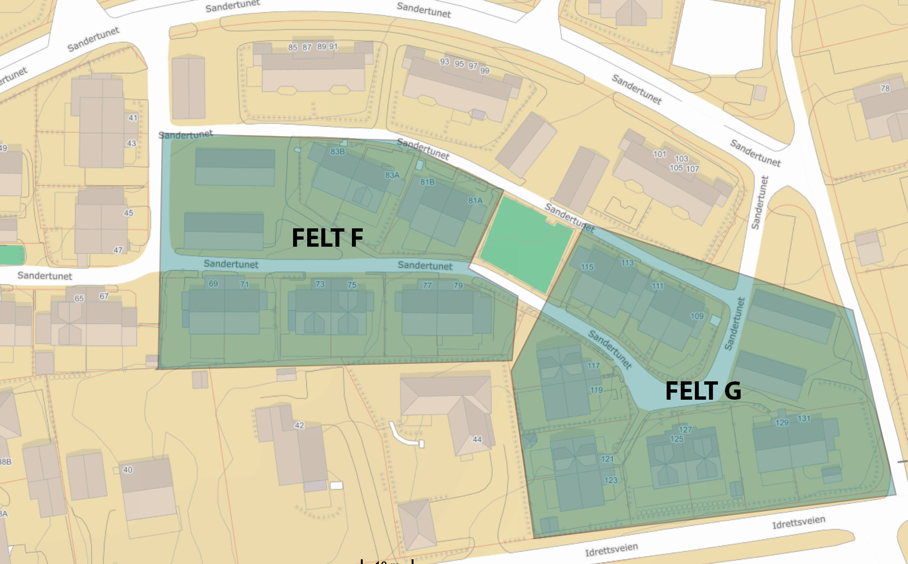

**Nyttig informasjon for beboere i Huseierforeningen Sandertunet Felt F & G**

## Kontaktinformasjon

Styrets e-postadresse: [styretfeltfogg@gmail.com](mailto:styretfeltfogg@gmail.com) 
Sameiets gruppe på [Facebook](https://www.facebook.com/groups/877059479046946) 
Garasjelag Felt F på [Facebook](https://www.facebook.com/groups/1727484427510301)

### Styret

| Rolle | Navn | Husnummer |
| - | - | - |
| Leder | Steve Kristiansen | 77 |
| Nestleder | Bjørn Buller | 111 |
| Kasserer | Erik Kjosbakken | 73 |
| Styremedlem | Celine Bisgaard Thuesen | 121 | 

## Innbetalinger

Årlige innbetalinger

| Beskrivelse | Beløp | Konto |
| --- | --: | --- |
| Fellesutgifter | 7200 | Felleskonto |
| Garasje | 1200 | Garasjelag for ditt felt |
| **Sum** | **8 400** | |

### Fellesutgifter
Hver husstand skal betale kr 600 pr. mnd. Dette dekker månedsavgift på kr 500, og vedklikeholdsfond på kr 100.
Husstanden må selv sørge for at det årlig blir betalt inn **kr 7 200** til felleskontoen vår.

### Garasjelag
Hver husstand med garasje skal betale kr 1200,- pr. år til sitt garasjelag. Dette dekker strøm til lys og forsikringer. Pengene skal inn på kontoen til garasjelaget du tilhører.

## Kontonummer

| Kontonummer | Navn | Formål |
| - | - | - |
| 9052 05 05287 | Felleskonto | Månedsavgift og felles kostnader. |
| 9052 11 45918 | Garasjelag Felt F | Beboere med garasje på felt F |
| 9052 11 45926 | Garasjelag Felt G | Beboere med garasje på felt G |

## Elbil-lading
Lader du elbil i garasjen må du lese av strøm ***minst en gang pr. halvår***. Forbruket skal registreres i [dette skjemaet](https://docs.google.com/forms/d/e/1FAIpQLSdTpdp8wu4aXWYwdSKjINeNtSKpoPs93_Bnnqeavd31EkTJkQ/viewform).

Pengene settes inn på kontoen til garasjelaget du tilhører.

For å regne ut forbruket ditt, tar du utgangspunkt i gjennomsnittspris på strøm pr. kw/h (strøm + nettleie).
Kontakt kasserer om du er usikker.

## Oversiktskart

